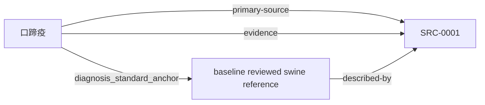

# Chicken Disease LLM Wiki Graph (Mermaid)

> Derived from wiki/graph-data.json. Open wiki/knowledge-graph.html for the interactive full-coverage view.

```mermaid
graph LR
  DIS_026["口蹄疫"] -->|primary-source| SRC_0001["SRC-0001"]
  DIS_026["口蹄疫"] -->|diagnosis_standard_anchor| STANDARD_78c7b3214edf7a["baseline reviewed swine reference"]
  DIS_026["口蹄疫"] -->|evidence| SRC_0001["SRC-0001"]
  STANDARD_78c7b3214edf7a["baseline reviewed swine reference"] -->|described-by| SRC_0001["SRC-0001"]
```
